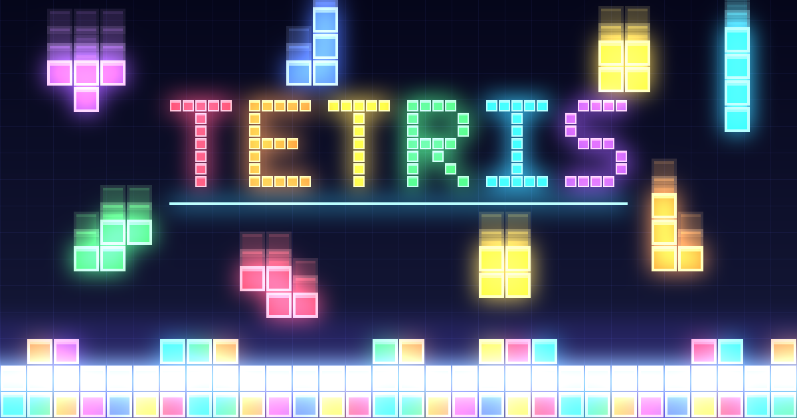

# Tetris

Classic Tetris in the browser, with neon visual effects as its twist: glowing pieces, line-clear
flashes, particles and a little screen shake. Seven pieces, hold, a next queue, keyboard and
touch. Plain HTML, CSS and JavaScript: no install, no sign-up, no build step.

**Play it:** [English](https://cocodedk.github.io/tetris/) · [فارسی](https://cocodedk.github.io/tetris/fa/)

[](https://cocodedk.github.io/tetris/)

## Controls

| Key | Action |
|---|---|
| ← → | Move |
| ↓ | Soft drop |
| Space | Hard drop |
| ↑ or X | Rotate clockwise |
| Z or Ctrl | Rotate back |
| C or Shift | Hold |
| P or Esc | Pause |

On a touch screen: tap to rotate, drag to move, flick down to drop.

## Run it locally

Any static server works. With Python:

```sh
python3 -m http.server 8000
```

Then open http://localhost:8000/ (English) or http://localhost:8000/fa/ (Persian).

## Test

```sh
node --test
```

Node 22 or newer. The suite has no dependencies and needs no network.

## Layout

| Path | Contents |
|---|---|
| `src/core/` | Game rules: board, pieces, rotation, scoring. Pure functions, no DOM. |
| `src/fx/` | Effect state: particles, shake, flashes, timers. Pure, stepped by `dt`. |
| `src/ui/` | Canvas drawing, input, screens, text in both languages. |
| `src/main.js` | Wires it together; loaded by both pages. |
| `index.html`, `fa/index.html` | The English and Persian pages. |
| `test/` | `node:test` suites mirroring `src/`, plus checks on the repository itself. |
| `scripts/` | `install-hooks.sh`, `setup-repo.sh` (publishing), `render-og.js` (the social image). |
| `spec/`, `specs/` | The product brief and one spec per feature. |

To re-render the social image `og.png` after a design change: `node scripts/render-og.js`.

## Contributing

See [CONTRIBUTING.md](CONTRIBUTING.md). Security reports go to babak@cocode.dk, see
[SECURITY.md](SECURITY.md).

## License

[Apache License 2.0](LICENSE). Copyright 2026 Babak Bandpey.

---

Made by Babak Bandpey at [Cocode](https://cocode.dk) · [LinkedIn](https://linkedin.com/in/babakbandpey)
